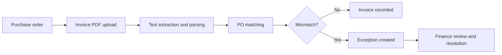

<div align="center">

# OpsFlow

### Production-ready accounts payable operations, from invoice intake to exception resolution.

OpsFlow is a multi-tenant AP operations platform that securely processes invoice PDFs, matches them to purchase orders, detects discrepancies, and gives finance teams a focused workflow for resolving exceptions.

[](https://opsflow-delta-brown.vercel.app)


[Production deployment](https://opsflow-delta-brown.vercel.app) · [Product overview](docs/PRODUCT.md) · [Architecture](docs/ARCHITECTURE.md) · [API reference](docs/API.md) · [Deployment guide](docs/DEPLOYMENT.md)

</div>

## What OpsFlow does

OpsFlow turns a manual invoice review into a controlled, tenant-aware workflow:



The current matching engine compares PO number, quantity, and unit price. It creates missing-document, quantity-mismatch, and price-mismatch exceptions automatically when validation fails.

> **Extraction today:** the production workflow uses deterministic PDF text extraction and typed validation. OpenAI structured extraction is planned and will be introduced with the current parser retained as a fallback.

## Production capabilities

| Area | Shipped capability |
| --- | --- |
| Invoice operations | PDF upload, text extraction, invoice parsing, PO matching, and exception generation |
| Exception workflow | Tenant-scoped exception queue and resolution workflow |
| Dashboard | Document totals, open-exception metrics, and recent exception visibility |
| Authentication | Clerk sign-in, sign-up, protected pages, and protected APIs |
| Multi-tenancy | Mandatory organization ownership and organization-scoped data access |
| Authorization | Six business roles, additive permissions, server-side enforcement, and role administration |
| Document security | PDF signature/type validation, 4 MB limit, opaque storage keys, and private Vercel Blob storage |
| Reliability | Transactional invoice processing, idempotent document reprocessing, stable API errors, and serializable retry handling |
| Operations | Audited administrator provisioning, audited legacy-data claims, migration runbook, and rollback guidance |

## Security and tenancy

Clerk owns authentication and organization identity. OpsFlow owns business authorization and financial-data access.

- Every Document, Purchase Order, Invoice, and Exception belongs to one internal organization.
- The active tenant is resolved from the authenticated server context, never from client input.
- Cross-tenant resource identifiers are returned as not found.
- New synchronized memberships start with the read-only Auditor role.
- Initial administrator provisioning is an explicit, audited operator action.
- Role changes require tenant-scoped permissions and cannot remove the last Organization Administrator.
- Uploaded documents remain outside the public web root and use private Blob storage in production.

See the accepted decisions for the [authorization model](docs/adr/0001-authorization-model.md), [multi-tenant ownership](docs/adr/0002-multi-tenant-data-ownership.md), and [business RBAC](docs/adr/0003-business-rbac-permissions.md).

## Architecture

OpsFlow uses a server-first Next.js architecture with one deployment unit for the UI, protected Route Handlers, and business services.

| Layer | Technology |
| --- | --- |
| Web application | Next.js 16 App Router, React 19, TypeScript, Tailwind CSS 4 |
| API | Next.js Route Handlers with centralized authorization |
| Data | Prisma 6 and Neon PostgreSQL |
| Identity | Clerk users and organizations |
| File storage | Private Vercel Blob in production; private local storage in development |
| Hosting | Vercel |
| PDF processing | `pdf2json` with validated deterministic parsing |

```text
Browser
  └── Next.js pages and layouts
        └── Authentication + business authorization
              └── Route Handlers and server-side services
                    ├── Prisma ── Neon PostgreSQL
                    └── Private document storage
```

## Run locally

### 1. Install dependencies

```powershell
npm ci
```

### 2. Configure the environment

Copy `.env.example` to `.env.local`, then provide:

- a pooled Neon connection as `DATABASE_URL`;
- the matching direct Neon connection as `DIRECT_URL`;
- Clerk publishable and secret keys plus the included redirect paths.

`BLOB_READ_WRITE_TOKEN` is required for private Vercel Blob storage. Leave it unset for local filesystem storage; do not retain the example placeholder as an active token.

### 3. Apply migrations

```powershell
npx prisma migrate deploy
```

### 4. Start the application

```powershell
npm run dev
```

Open [http://localhost:3000](http://localhost:3000), sign in, and select a Clerk organization. New memberships intentionally start as Auditor. Follow the [authorization operations runbook](docs/AUTHORIZATION_OPERATIONS.md) to provision the first Organization Administrator.

## Quality gates

The production release is verified with the following checks:

```powershell
npm test
npm run typecheck
npm run lint
npx prisma validate
npm run build
git diff --check
```

An opt-in database-backed tenant-isolation suite is also available for a dedicated disposable database:

```powershell
$env:TEST_DATABASE_URL = "postgresql://..."
$env:ALLOW_DATABASE_TESTS = "true"
npm run test:db
```

Never point the database-backed test suite at production or a shared development database.

## API surface

Authenticated, permission-checked Route Handlers cover:

- organizations and organization display settings;
- memberships and business-role assignment;
- documents and validated uploads;
- purchase orders and invoices;
- invoice processing and idempotent retries;
- exception creation, listing, and resolution.

Payloads, permission behavior, and response semantics are documented in the [API reference](docs/API.md).

## Current release and roadmap

Sprint 3—Production Readiness—is complete. The current release is deployed to Vercel with a migrated Neon schema and private Blob storage. Anonymous production smoke tests cover protected routing, the public sign-in surface, and the API `401` contract; the authenticated workflow checklist is maintained in the [deployment runbook](docs/DEPLOYMENT.md).

| Available now | Planned |
| --- | --- |
| Purchase orders and 2-way invoice matching | OpenAI structured invoice extraction |
| Secure PDF intake and deterministic parsing | Goods receipts and 3-way matching |
| Automated exception detection and resolution | Approval workflows and audit timeline |
| Multi-tenant RBAC and tenant isolation | Vendor analytics and fraud detection |
| Production deployment and operational runbooks | Executive analytics and payment risk scoring |

## Documentation

- [Product and users](docs/PRODUCT.md)
- [Business process](docs/BUSINESS_PROCESS.md)
- [Architecture](docs/ARCHITECTURE.md)
- [Database design](docs/DATABASE.md)
- [API reference](docs/API.md)
- [Deployment and rollback](docs/DEPLOYMENT.md)
- [Authorization operations](docs/AUTHORIZATION_OPERATIONS.md)
- [Contributing](docs/CONTRIBUTING.md)

---

<div align="center">
Built as an enterprise SaaS foundation for finance, procurement, and operations teams.
</div>
